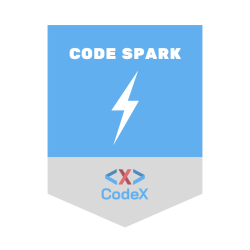
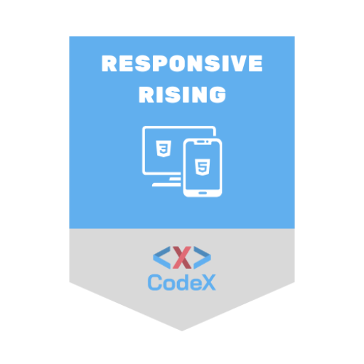
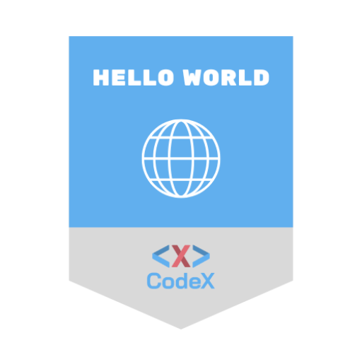
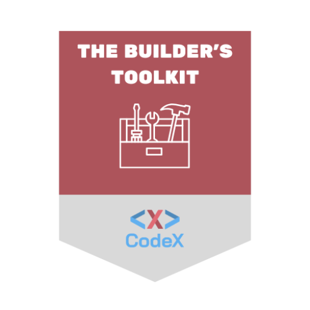

# Hello, I'm Shanae👋
By day, I'm a pharmacy technician & by night, I'm building my future in tech. I'm learning JavaScript, Git and GitHub one project at a time as I work toward becoming a software engineer.

## Badges

  
  
  
  

## Fun Facts
#### 💻 Software Development Fun Fact:
- The world's first computer programmer was a woman - Ada Lovelace. Long before modern computers existed, she wrote what is considered the first computer algorithm in the 1840s. Her work helped lay the foundation for programming as we know it today. She detailed how the machine could repeat a series of instructions, introducing the core programming concept of looping. 
#### 💊 Pharmacy Fun Fact:
- The pharmacy symbol is called the Bowl of Hygeia. The snake represents healing and renewal because it sheds its skin. That's why you might see a snake wrapped around a bowl on some logos around the world.
#### 💻 Software Development + 💊 Pharmacy Fun Fact:
- Both fields have "bugs" to fix! In pharmacy, a tiny mistake like entering the wrong strength or quantity can cause a prescription "bug" that must be corrected before dispensing. In software development, programmers track and fix coding bugs. In both careers, careful attention to detail keeps people safe and systems running smoothly. 

<!--
**helloimshanae/helloimshanae** is a ✨ _special_ ✨ repository because its `README.md` (this file) appears on your GitHub profile.

Here are some ideas to get you started:

- 🔭 I’m currently working on ...
- 🌱 I’m currently learning ...
- 👯 I’m looking to collaborate on ...
- 🤔 I’m looking for help with ...
- 💬 Ask me about ...
- 📫 How to reach me: ...
- 😄 Pronouns: ...
- ⚡ Fun fact: ...
-->
